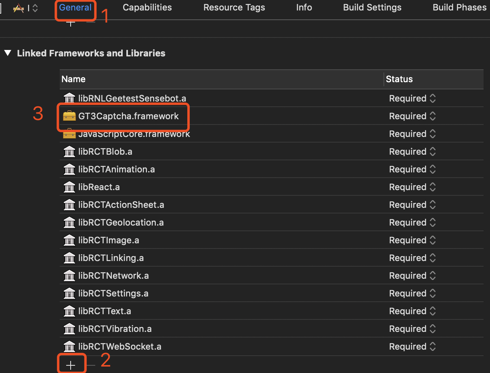

# react-native-geetest-sensebot

[GEETEST极验行为验证](https://docs.geetest.com/install/overview/start/) [](https://www.npmjs.com/package/@yyyyu/react-native-geetest-sensebot)

**SDK Version**
iOS: v0.11.7_20190314
Android: v4.0.7_20190311

**测试环境**
Xcode 10.2.1
react-native 0.59.5

## Getting Started

```bash
yarn add @yyyyu/react-native-geetest-sensebot
# or
npm i @yyyyu/react-native-geetest-sensebot --save
```

```bash
react-native link @yyyyu/react-native-geetest-sensebot
```

### iOS 如果没有使用 CocoaPods

在 Linked Frameworks and Libraries 中添加 node_modules/@yyyyu/react-native-geetest-sensebot/ios/SDK/GT3Captcha.framework



如果编译报错 <span style="color:red;font-weight:bold;">Framework not found GT3Captcha</span>, 在 Framework Search Paths 添加 $(SRCROOT)/../node_modules/@yyyyu/react-native-geetest-sensebot/ios/SDK


### Android

1. android/build.gradle

```Groovy
allprojects {
    repositories {
        // ...
        // 与 android/app/build.gradle 中名称一致
        flatDir {
            dirs project(':@yyyyu_react-native-geetest-sensebot').file('libs')
        }
    }
}
```

2. AndroidManifest.xml 中添加权限

```xml
// ...
<uses-permission android:name="android.permission.INTERNET" />
<uses-permission android:name="android.permission.ACCESS_WIFI_STATE" />
<uses-permission android:name="android.permission.ACCESS_NETWORK_STATE" />
<uses-permission android:name="android.permission.READ_PHONE_STATE" />
```

## Example

```javascript
import React, { Component } from 'react'
import { View, Button } from 'react-native'
import RNGeetestSensebot from '@yyyyu/react-native-geetest-sensebot'

export default class App extends Component {
  geetest = async () => {
    let api1Result
    try {
      const api1Response = await fetch('http://www.geetest.com/demo/gt/register-test')
      api1Result = await api1Response.json()
    } catch (e) {
      return console.log('API1 request failed, message: %s.', e.message)
    }

    let geetestResult
    try {
      geetestResult = await RNGeetestSensebot.start({
        api1Result,
        // optional default false
        debug: true,
        // optional default 10s
        loadTimeout: 10000,
        // optional default 10s
        reqTimeout: 10000,
        // optional default system
        lang: RNGeetestSensebot.Lang.System,
        // optional default false
        enableBackgroundCancel: true,
        // optional default transparent
        backgroundColorIOS: 'red',
        // optional default none
        backgroundBlurEffectIOS: RNGeetestSensebot.BackgroundBlurEffectIOS.Regular,
        // optional
        onEvent: (code, data) => {
          if (code === RNGeetestSensebot.Event.FAILED) {
            console.log('Validate failed, reason: %s', data[0])
          } else {
            console.log(RNGeetestSensebot.Event[code], data)
          }
        }
      })
    } catch (e) {
      return console.log('Error, code: %d, message: %s.', e.code, e.message)
    }

    let api2Result
    try {
      const api2Response = await fetch('http://www.geetest.com/demo/gt/validate-test', {
        method: 'POST',
        headers: { 'Content-Type': 'application/json;charset=UTF-8' },
        body: JSON.stringify(geetestResult)
      })
      api2Result = await api2Response.json()
    } catch (e) {
      return console.log('API2 request failed, message: %s.', e.message)
    }

    console.log('Validate result: %o.', api2Result)
  }

  render() {
    return (
      <View style={{ flex: 1, justifyContent: 'center', alignItems: 'center' }}>
        <Button title='StartGeetest' onPress={this.geetest} color='#26c6aa' />
      </View>
    )
  }
}
```

## Option

```javascript
interface Option {
  // API1
  api1Result: API1Result;
  // debug
  debug?: boolean;
  // view 加载超时时间，默认10000
  loadTimeout?: number;
  // 第二步向极验服务器发送请求超时时间，默认10000
  reqTimeout?: number;
  // 语言，如果为null则使用系统默认语言
  lang?: Lang;
  // 点击背景是否可以取消验证
  enableBackgroundCancel?: boolean;
  // 背景色 IOS Only
  backgroundColorIOS?: any;
  // 背景模糊类型 IOS Only
  backgroundBlurEffectIOS?: BackgroundBlurEffectIOS;
  // 事件监听
  onEvent?: (code: Event, data?: Array<number | string>) => void;
}
interface API1Result {
  success: 0 | 1;
  challenge: string;
  gt: string;
  new_captcha: boolean;
}
enum Lang {
  System = "system",
  ZH = "zh",
  ZH_TW = "zh-tw",
  ZH_HK = "zh-hk",
  EN = "en",
  ID = "id",
  JA = "ja",
  KO = "ko",
  RU = "ru",
  AR = "ar",
  ES = "es",
  PT_PT = "pt-pt",
  FR = "fr",
  DE = "de"
}
enum BackgroundBlurEffectIOS {
  None = -1,
  ExtraLight = 0,
  Light = 1,
  Dark = 2,
  Regular = 3,
  Prominent = 4
}
enum Event {
  RESULT = 1,
  CLOSED = 2,
  FAILED = 3,
  ERROR = 0
}
enum Error {
  PARAMETER_PARSE_FAILED = -1,
  ANDROID_ACTIVITY_DESTROYED = -2
}
interface Result {
  geetest_challenge: string;
  geetest_seccode: string;
  geetest_validate: string;
}
```
